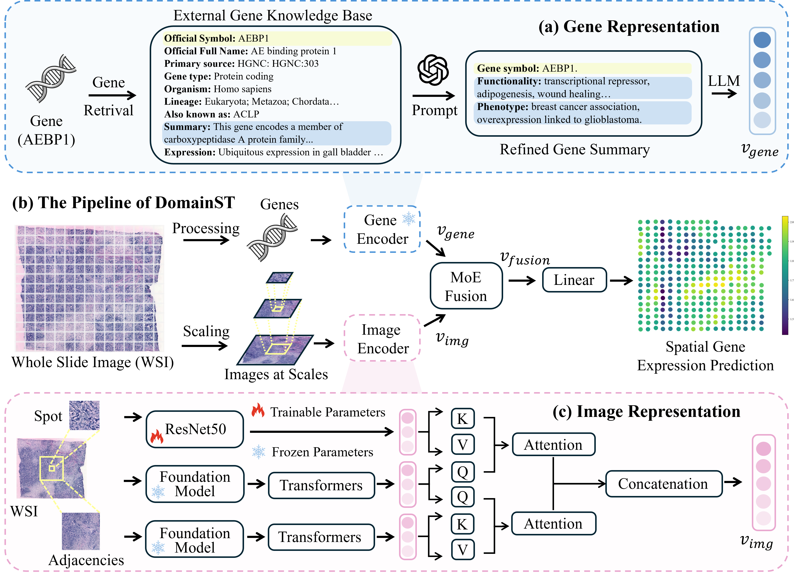

# Bridging imaging and genomics: Domain knowledge guided spatial transcriptomics analysis

Thank you for your attention of our work. This is the codebase for DomainST.



## Environment

``````
Python 3.10+
PyTorch 2.0+
PyTorch Lightning 2.0+
``````

We also provide a requirement.txt file for you to track the version of each package in our setting. 

## Data Downloading

All data used in this study can be found at [Huggingface](https://huggingface.co/datasets/wzhang472/dst/tree/main), please feel free to reach me if you have any trouble in downloading the data. After downloading all data, you will obtain below data directory:

```
	./data/
	├── her2st
    │ 		├── gt_features_224
    │ 		├── n_features_5_224
    │ 		├── ST-cnts
    │ 		├── ST-imgs
    │ 		├── ST-spotfiles
    │ 		├── her2st_ncbi_conch.pt
    │ 		└── ...
	├── skin
    │ 		└── ...
	└── stnet
    		└── ...
```

## Image Feature Extraction

If you wish to use other foundation model alternatives, such as UNI, take HER2+ dataset as an example, the command for feature extraction can be found below:

```
python extract_features.py --config her2st/DomainST --test_mode internal --extract_mode target --encoder uni
python extract_features.py --config her2st/DomainST --test_mode internal --extract_mode neighbor --encoder uni
```

## Gene Feature Extraction

Our gene feature extraction have multiple steps:

1. Gene summary retrieval from external gene databases
2. Gene summary refinement by LLM
3. Gene embedding

The gene summary, and gene features can be found at [Huggingface](https://huggingface.co/datasets/wzhang472/dst/tree/main) with the .pt format.

To provide more gene representation alternatives, we will provide more details about using other free accessed LLMs for reproducibility once we have these code and features well-organized. Thank you for your patience. 

## Training and Evaluation

Before starting training, please make sure the directories in ./config/skin/DomainST.yaml and ./util.py are updated accordingly to your work environments.

```
# Training
python main.py --config skin/DomainST --mode cv --gpu 0 --model_name your_model

# Evaluation
python test.py --dataset skin --gpu 0 --model_name your_model
```


## TODO

- [x] Image features with foundation models 
- [ ] Gene summary from external gene databases 
- [ ] Gene summary refinement via LLMs
- [ ] Gene feature extraction with text encoders


## Acknowledgement

Our study builds upon previous studies: [TRIPLEX](https://github.com/NEXGEM/TRIPLEX), [HisToGene](https://github.com/maxpmx/HisToGene). Many thanks for their opensource and the contributions to this community.


## Citation 

Please feel free to cite as if our work could be helpful for your study. Thank you.

```
@article{zhang2025domainst,
  title={Bridging Imaging and Genomics: Domain Knowledge Guided Spatial Transcriptomics Analysis},
  author={Zhang, Wei and Liu, Xinci and Chen, Tong and Xu, Wenxin and Sakal, Collin and Nie, Ximing and Wang, Long and Li, Xinyue},
  journal={Information Fusion},
  pages={103746},
  year={2025},
  publisher={Elsevier}
}
```